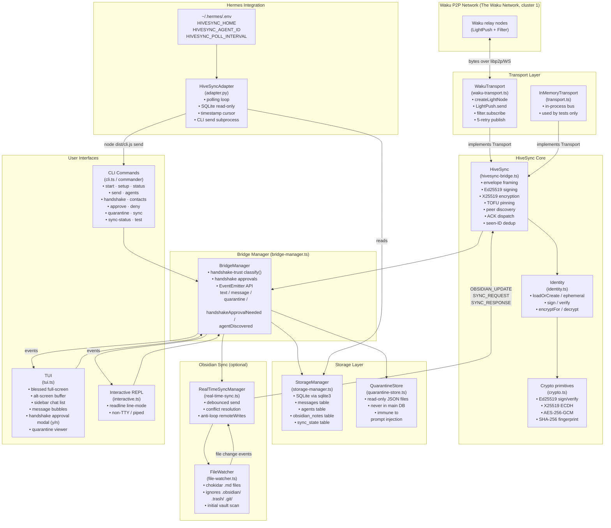
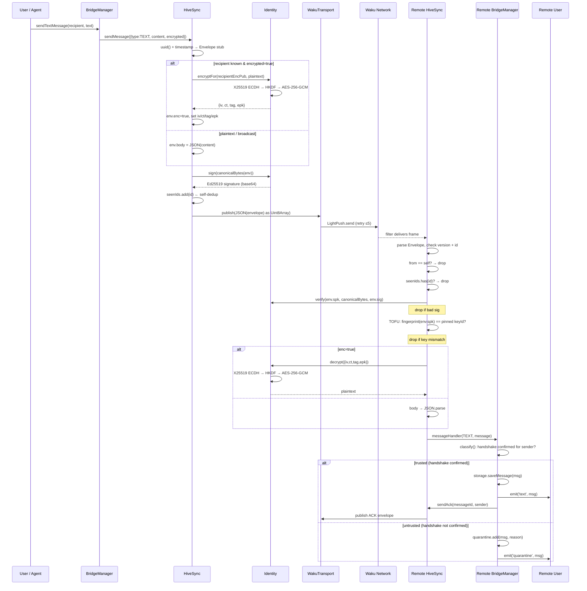
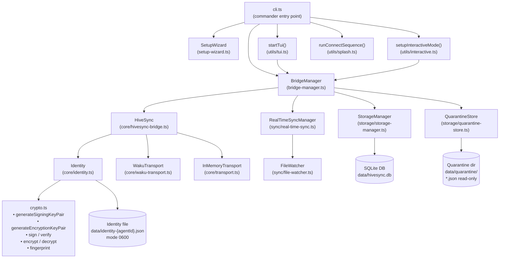

# HiveSync Architecture

## Overview

HiveSync is a P2P secure messaging bridge for AI agents built on the
[Logos Messaging](https://logos.co) decentralized network (the protocol
formerly known as Waku).  It runs as a local Node.js
daemon and exposes two human-facing UIs (a blessed TUI and a readline REPL) as
well as a programmatic API consumed by the Hermes agent plugin.

---

## 1. High-Level Component Graph

---

## 2. Message Send/Receive Sequence

---

## 3. Component Hierarchy

---

## 4. Layer Descriptions

### 4.1 Transport Layer (`src/core/transport.ts`, `src/core/waku-transport.ts`)

The `Transport` interface exposes four primitive operations: `start`, `subscribe`,
`publish`, and `stop`.  It is the only abstraction that knows about bytes on the
wire; everything above it works with structured `Envelope` objects.

**`WakuTransport`** wraps `@waku/sdk`.  Because `@waku/sdk` is ESM-only and the
project compiles to CommonJS, the SDK is loaded lazily with a `new Function('return
import("@waku/sdk")')()` trick, cached in a module-level promise.  On startup it
creates a **light node** that dials The Waku Network bootstrap fleet, then waits
for at least one peer that supports both `LightPush` (for sending) and `Filter`
(for receiving) protocols.

Publishing retries up to 5 times with 1.5 s × attempt back-off; a partial success
(≥1 peer accepted the push) is treated as delivered, matching real-world Waku
behaviour where RLN rate-limiting causes some peers to reject pushes.

**`InMemoryTransport`** is a deterministic in-process bus keyed by content topic.
Frames are delivered asynchronously via `setImmediate`, mirroring real network
semantics without touching sockets.  It is used exclusively by the test suite.

---

### 4.2 Crypto & Identity (`src/core/crypto.ts`, `src/core/identity.ts`)

Every agent owns two persistent key pairs:

| Key type | Algorithm | Use |
|----------|-----------|-----|
| Signing | Ed25519 | Message authentication (every envelope carries a signature) |
| Encryption | X25519 | ECDH key agreement for E2E encryption |

Keys are serialized as base64-encoded DER (SPKI for public, PKCS8 for private) and
stored in a JSON file at `data/identity-{agentId}.json` with mode `0600`.

**Encryption** uses ECDH + HKDF + AES-256-GCM:
1. Sender picks its X25519 private key and the recipient's X25519 public key.
2. `crypto.diffieHellman` computes a shared secret.
3. `hkdfSync('sha256', shared, '', 'hivesync/v1/aes-256-gcm', 32)` derives a 32-byte AES key.
4. `createCipheriv('aes-256-gcm', key, iv)` encrypts; the tag is appended to the envelope.
5. The sender's ephemeral public key (`epk`) is included so the recipient can perform
   the same ECDH.

Trust between agents is **not** handled here — it is a separate handshake-approval
layer in `BridgeManager` (§4.4).  Encryption and signing apply to every message
regardless of whether the peer is trusted.

---

### 4.3 HiveSync Bridge (`src/core/hivesync-bridge.ts`)

`HiveSync` is the messaging core.  It knows nothing about the UI or access control;
it just frames, signs, routes, and deduplicates.

**Envelope** fields (see §2 of SPECIFICATION for full schema):
- `v` — protocol version (currently 1)
- `from` / `to` — agent IDs (`broadcast` for public messages)
- `type` — one of `ANNOUNCE | TEXT | COMMAND | ACK | FILE | SYNC_*`
- `spk` / `sig` — sender's signing public key and Ed25519 signature
- `enc` — whether the body is encrypted
- `body` / `iv` + `ct` + `tag` + `epk` — plaintext or ciphertext fields

**TOFU pinning**: when a peer's first message arrives, `fingerprint(env.spk)` is
stored.  Subsequent messages from the same agent ID with a different fingerprint
are silently dropped, preventing identity hijacking.

**Discovery** (`ANNOUNCE` messages): on connect, HiveSync broadcasts its agent ID,
name, and both public keys.  It repeats this at 2 s and then every `syncInterval`
seconds.  When a previously-unseen agent is discovered, HiveSync fires a reply
announce so the newcomer learns about us promptly.

**Deduplication**: a sliding window of 5000 seen message IDs prevents processing
the same frame twice (Waku can re-deliver frames across relay nodes).

---

### 4.4 Bridge Manager (`src/core/bridge-manager.ts`)

`BridgeManager` is the orchestration and access-control layer.  It wraps
`HiveSync`, exposes an `EventEmitter` API to the UI, and enforces the
**handshake-based trust model** (a layer separate from encryption).

**Access control (`classify`)**:
- A message is trusted only if its sender has a **confirmed handshake**
  (`HandshakeStatus === 'confirmed'`).  `HANDSHAKE_INIT`/`HANDSHAKE_ACK` frames
  bypass this check so trust can be established in the first place.
- Untrusted messages (sender not yet approved) go to the quarantine store; they
  are never stored in the main database and never executed.

**Handshake approval**:
- On discovering a peer, `HiveSync` auto-initiates a handshake.  When a peer sends
  *us* a `HANDSHAKE_INIT`, `BridgeManager` records a **pending approval** in
  storage and emits `handshakeApprovalNeeded`.
- The **local user** approves (`hivesync approve <agentId>`, or `y` in the TUI
  modal) or denies (`hivesync deny <agentId>`, or `n`).  Because approvals are
  persisted, `BridgeManager` polls the store and completes handshakes recorded by
  a separate CLI process; on a confirmed handshake the peer is promoted to a
  trusted `Contact`.

---

### 4.5 Storage Layer (`src/storage/`)

**`StorageManager`** opens a SQLite database at the configured `storagePath` and
manages four tables (full schema in SPECIFICATION §4):
- `messages` — all delivered trusted messages (both inbound and outbound)
- `agents` — discovered peers keyed by agent ID
- `obsidian_notes` — Obsidian vault note snapshots
- `sync_state` — per-peer sync counters

**`QuarantineStore`** writes untrusted messages as individual read-only JSON files
(`mode 0444`) in a `quarantine/` directory alongside the database.  This design is
deliberate: prompt-injection content is never parsed by any agent code path after
the initial save, and a human can inspect the files without risk.

---

### 4.6 Obsidian Sync (`src/sync/`)

`RealTimeSyncManager` bridges HiveSync messaging with an Obsidian vault on disk.
It is entirely optional and starts only when `obsidian.enabled = true` and the
vault path exists.

- **`FileWatcher`** uses `chokidar` to watch `*.md` files, ignoring `.obsidian/`,
  `.trash/`, and `.git/`.  An initial vault scan on startup registers all existing
  notes.  File changes are debounced for 1 second to batch rapid edits.
- **Anti-loop**: when `RealTimeSyncManager` writes a remote update to disk, it
  adds the path to `remoteWrites` so the resulting file-watcher event is discarded.
- **Conflict resolution**: last-write-wins by `lastModified` timestamp.  Same-
  timestamp + different hash → conflict logged, existing version kept.

---

### 4.7 User Interfaces

**TUI** (`src/utils/tui.ts`): a Telegram-Desktop-inspired full-screen terminal
messenger built with `blessed`.  Uses the **alt-screen buffer** (`screen.program.alternateBuffer()`) so the application's output never leaks into the terminal's
scroll-back history.  Features include coloured monogram "avatars", left/right
message bubbles, live search filtering, a handshake approval modal (press `y` to
approve an incoming handshake, `n` to deny), and a read-only quarantine viewer.

**Interactive REPL** (`src/utils/interactive.ts`): a simple `readline`-based
line-mode shell.  Used when `--plain` is passed, output is piped (non-TTY), or
when running in daemon mode.

**CLI** (`src/cli.ts`): `commander`-based sub-commands.  The `start` command
chooses between the TUI (interactive TTY), the REPL (`--plain`), and daemon mode
(`--daemon`).

---

### 4.8 Hermes Integration (`hermes-setup/adapter.py`)

The Hermes adapter is a **polling gateway plugin** that lets the Hermes AI agent
communicate over HiveSync without embedding a Node.js runtime:

1. **Inbound**: `_poll_loop` runs every `poll_interval` seconds.  It connects to
   the HiveSync SQLite database **in read-only mode** (`?mode=ro` URI) and
   queries for new messages using a timestamp cursor stored in
   `data/.hermes-last-ts`.  Each qualifying row is converted to a `MessageEvent`
   and passed to Hermes via `handle_message`.

2. **Outbound**: `send()` spawns `node dist/cli.js send --no-sync <recipient>
   <message>` as a subprocess with a 60-second timeout.

3. **Authorization**: the adapter maintains an `allow_all` flag and an
   `allowed_users` allowlist.  Senders not on the list are silently dropped before
   being forwarded to Hermes.

The `hermes-setup.sh` script automates the entire integration: builds HiveSync,
writes `config/hivesync.yaml`, copies the adapter into
`~/.hermes/plugins/hivesync-platform/`, and writes environment variables to
`~/.hermes/.env`.
